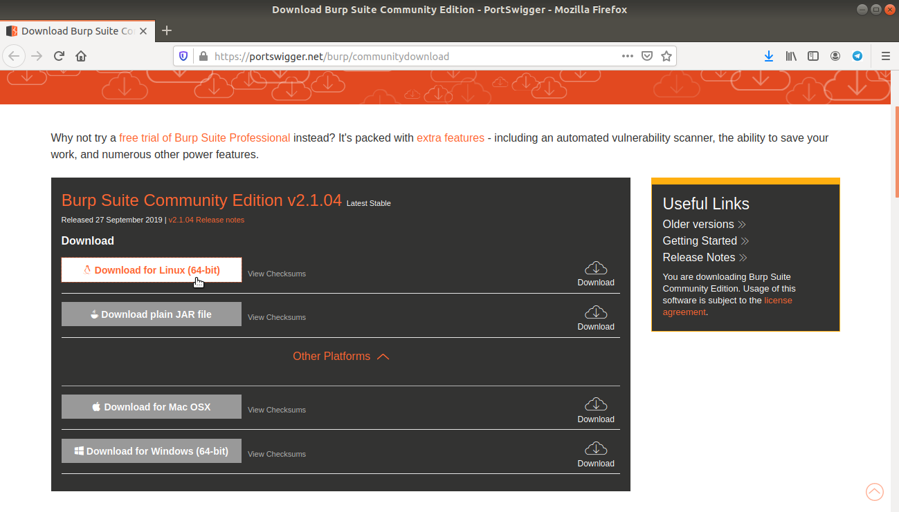
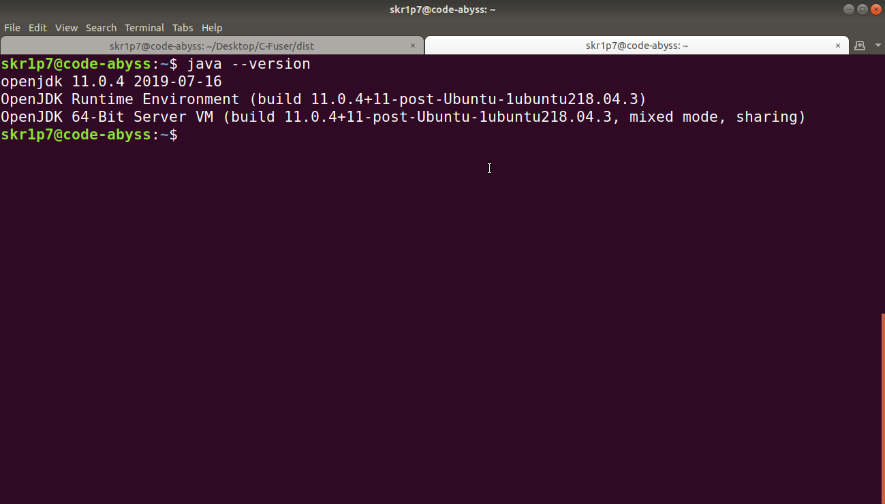
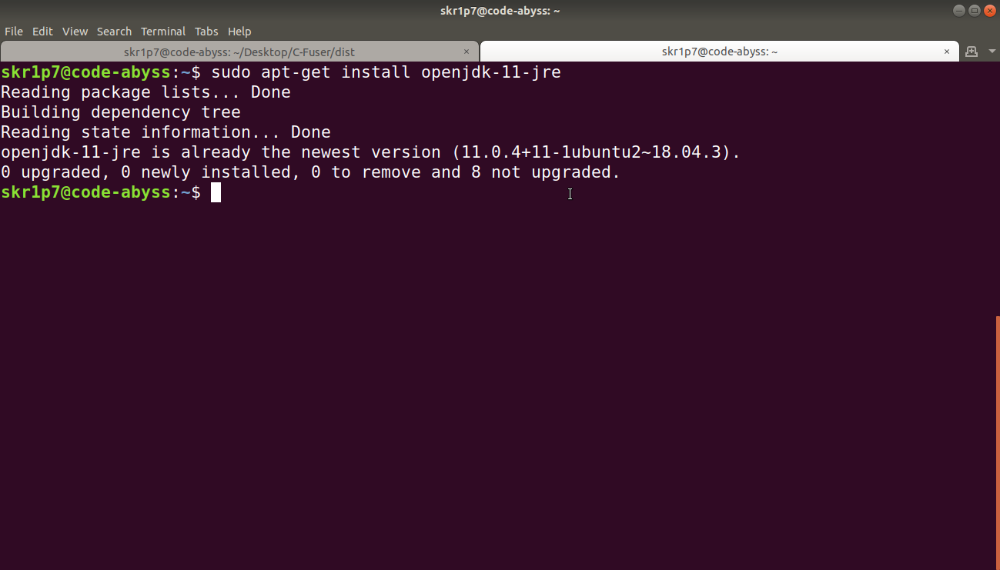
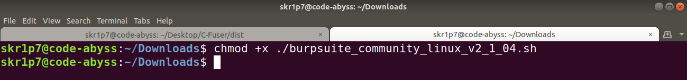
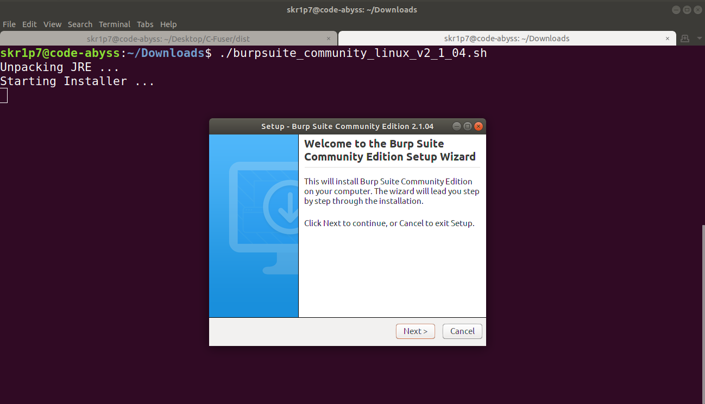
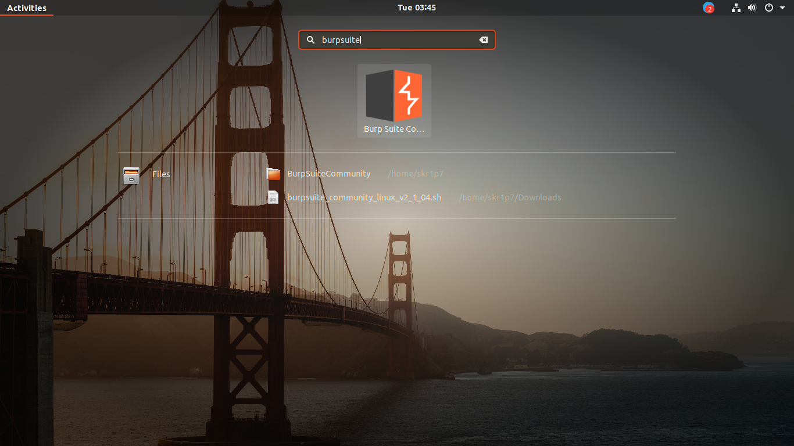
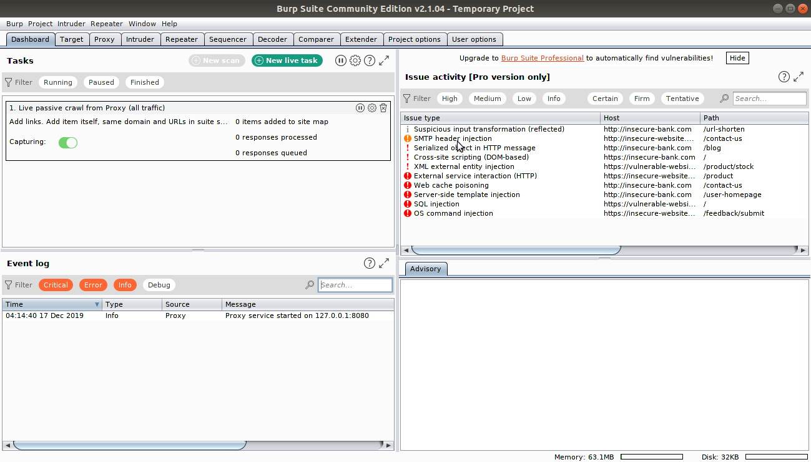
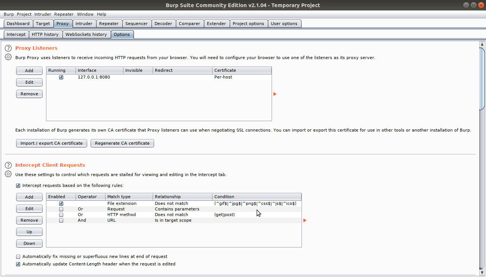
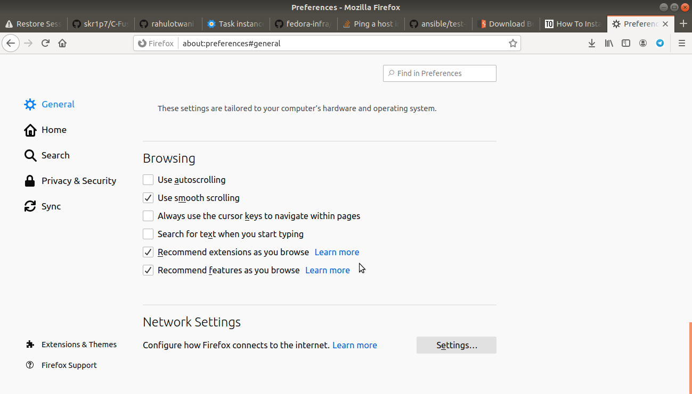
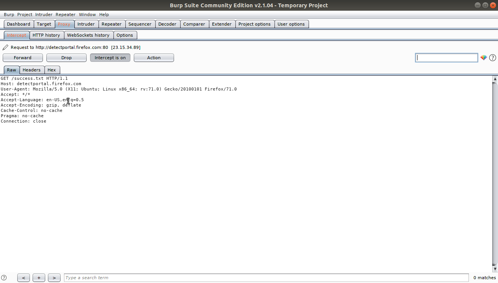

# BurpSuite installation in Ubuntu 16.04/18.04

## Follow the steps as mentioned along with the screenshots in order to double-check if you've missed any steps

### Installation

Go to the [PortSwigger](https://portswigger.net/burp/communitydownload) website and download the installer. 

 


Check if you have java insalled in your computer or not by using the following command:

```bash
$ java --version
```

The output should look like this if you have it installed in your machine;



If Java is not installed, use the following command to install Java 11

```bash
$ sudo apt-get install openjdk-11-jre
```

As I have Java 11 already installed, the output looks something like this:



Now as we have already downloaded the installer for Linux, let's navigate into the **Downloads** directory using the following command:

```bash
$ cd Downloads
```

Up next we have to give executible permissions to the downloaded installed using the follwing command:

```bash
$ chmod +x ./chmod +x ./burpsuite_community_linux_v2_1_04.sh
```



And run the installed using the following command:

```bash
$ ./burpsuite_community_linux_v2_1_04.sh
```

This will pop the installer window that looks something like this:



Complete the wizard and click on the 9 dots **Show Application** icon on the bottom-left corner of the default window of Ubuntu and search for **burpsuite**. 

If you have completed all the above steps carefully and completed the wizard without any errors, the search window will look something like this:



Hit enter end you'll see a window that will ask you to accept or decline the ***Terms and Conditions*** 

Click on **I accept** and create a **Temporary project** by clicking on the radio buton and clicking next followed by selecting **default configuration**.

You'll see a window that looks similar to this:



Go to the **Proxy** tab and click on **Options** and check the button in front of ***127.0.0.1*** interface if already not checked.




### Proxy configuration

1. In Firefox, Go to Firefox menu and click on “Preferences”.
2. Select the General Tab and find **General** tab which is usually a geared icon.
3. At the end you will see the “Network Proxy” settings. Click on settings button. 



4. Enter **127.0.0.1** in the **HTTP Proxy** field and **8080** in the **Port** field. Make sure to click on the **“Use this proxy server for all protocols"**.

5. Click okay and close the **Preference window**


### Intercepting the HTTP Header 

As this is a Google Code-In task, let's target (https://codein.withgoogle.com) in the URL bar of our browser and come back to BurpSuite and click on **Intercept** tab, here's what we've got!


